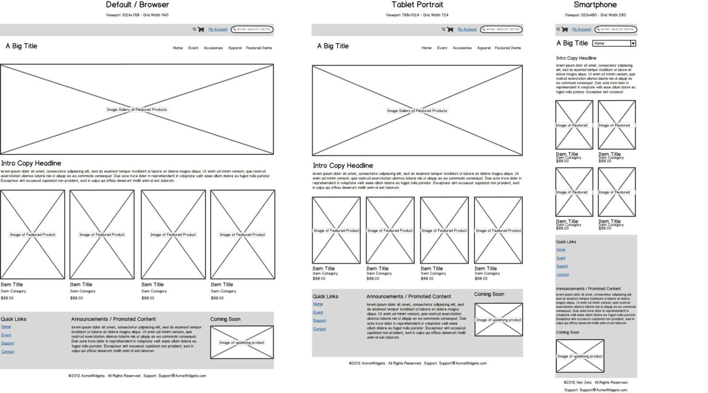
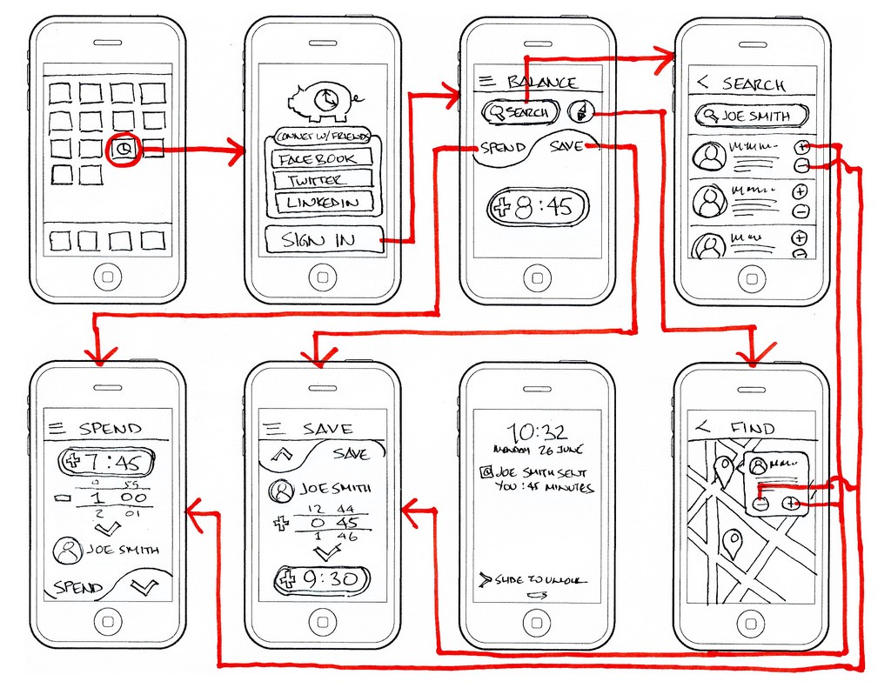
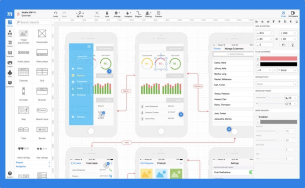

## ÍNDICE
- [Consideraciones de uso](#consideraciones-de-uso)
  - [Wireframe & Mockup](#wireframe--mockup)
    - [El Wireframe](#el-wireframe)
    - [El Mockup](#el-mockup)
  - [Uso de comentarios en HTML](#uso-de-comentarios-en-html)
  - [Formateo de estilos](#formateo-de-estilos)
  - [Escribiendo clases](#escribiendo-clases)

# Consideraciones de uso

## Wireframe & Mockup

Cuando deseamos crear una página web necesariamente debemos hablar de diseño de **interfaz de usuario**, esto puede ser subestimado cuando apenas comenzamos en el mundo web pero es realmente una parte importante en la que tenemos en cuenta el flujo de navegación. **El 'como' presentamos la información** a un usuario es más que un arte, pues existen formas más o menos eficientes si queremos lograr un objetivo, por ejemplo:

* ¿Cómo presentamos la información para que nuestro visitante quiera aprender más sobre el calentamiento global?
* ¿Cómo mostrarle al usuario que, a parte de nuestro producto principal, también tenemos excelentes promociones en otras categorías? 
* ¿Consiguió el usuario fácilmente la información que buscaba al entrar en nuestro sitio?

También tenemos que tomar en cuenta la parte visual de nuestra web pues un sitio que no sea agradable a la vista es poco probable que tenga éxito, o que tal si escogemos un color que psicológicamente consiga un efecto diametralmente opuesto al que nosotros queremos. 

Todas estas son decisiones que debemos tomar antes de empezar a escribir algún código, pues será la base de todo lo que vamos a construir y si queremos hacer un buen trabajo toda esa base debe estar sustentada con un 'por qué' de cada decisión.

### El Wireframe

Un wireframe no es más que un boceto rápido, en el **no incluiremos colores ni imágenes**, este se hace a blanco y negro, incluso muchas veces se trabaja manualmente con lápiz y papel.

El objetivo detrás de un wireframe es **plasmar las ideas** que tenemos para la disposición de elementos y el flujo que tendrá nuestra página, esto nos permite tener una idea general de lo que queremos lograr y tomar unas primeras **decisiones provisionales que podemos modificar de manera muy rápida y sencilla**, esto también es útil si estamos frente a un cliente, con el podemos intentar plasmar en frío las características que nos quiere trasmitir y llevarnos un concepto mejor definido del trabajo que debemos realizar.

En este punto **decidimos que tipo de información vamos a necesitar** en cada elemento (nombres de productos, direcciones, descripciones,...etc.) y marcaremos los "Call to Action" que son los botones o links que nos permite navegar hacia otras partes de la web, esto es lo que llamamos flujo, pues debemos tener en cuenta las necesidades del usuario, como de volver a tras o seguir adelante, o quizás facilitarle la navegación hacia otra sección aparentemente inconexa.





### El Mockup

En el wireframe definimos los elementos, la cantidad de páginas que llevara nuestra web he incluso tomamos en cuenta el flujo de navegación y la manera en que presentaremos la información de manera conveniente, una vez estemos satisfechos es hora de darle vida a esto.

El Mockup es una herramienta en la que hacemos un boceto con detenimiento,  en él decidimos **los colores** que vamos usar, que **imágenes** son convenientes poner, que **fuentes de texto** nos conviene usar, los **tamaños de dicha fuente** y entre otros; aquí **podremos mucha atención al aspecto visual** y definimos un estándar para nuestra web.

Esta herramienta se hace muy útil por varias razones, normalmente la trabajamos en algún tipo de software de manejo de imágenes o vectores (Photoshop o Illustrator por ejemplo), pero en la actualidad existen también muchas herramientas (Scketch o Adobe XD por ejemplo) que **están específicamente diseñadas para la creación de Interfaces de Usuario** y que hacen muchos más cómodo he intuitivo diseñar este tipo de trabajos. 

El diseño visual suele ser muy cambiante debido a que nos gusta experimentar con diferentes cosas, combinaciones, estilos o quizás porque el cliente requiera cambios, **un mockup nos permite gestionar de forma  apropiada dichos cambios hasta obtener un resultado satisfactorio**, debemos tomar en cuenta que no siempre diseñar sobre código pueda ser lo más óptimo (o sí, dependiendo de tus habilidades y gustos) y un pequeño error en el código a veces nos puede llevar varios minutos o incluso horas de solucionar, esto podría matar nuestra inspiración de momento, desviando nuestra etapa de diseño y retrasando nuestro trabajo, es aquí donde tener un mockup tiene sentido ya que nos permite dedicarnos únicamente al diseño visual y nos permite ver resultados e iterar de una forma muy rápida.




## Uso de comentarios en HTML

Los comentarios ayudan mucho cuando queremos describir la funcionalidad de algún código que estemos escribiendo, así podremos dar una referencia de lo que queremos expresar, tanto para otras personas como para nosotros mismos en el futuro quienes luego de meses de no ver algún código podríamos no recordar que es lo que estábamos haciendo.

Una práctica común y muy útil en HTML para ubicarnos mejor dentro del html es comentar el inicio y el cierre de las secciones, por ejemplo

```html
<body>
    <!-- Article about mom -->
    <article>
        <!-- Her originate -->
        <section>
        </section>
        <!-- End her origen -->
        <!-- Her present -->
        <section>
        </section>
        <!-- End her present -->
    </article>
    <!-- End Aaticle about mom -->
    <!-- Article about dad -->
    <article>
        <!-- Him originate -->
        <section>
        </section>
        <!-- End him originate -->
        <!-- Him present -->
        <section>
        </section>
        <!-- End him present -->
    </article>
    <!-- End article about dad -->
</body>
```

Esto puede parecer excesivo al principio pero cuando manejamos archivos con cientos de líneas puede ser realmente de mucha ayuda.

## Formateo de estilos

Por lo general, los navegadores incluyen por defecto algunos estilos y la mayor parte de las veces vamos a querer trabajar desde cero para tener un control total sobre nuestro diseño.

Una técnica muy usada al implementar CSS es el formateo del ```HTML``` y el ```body```, esto podríamos indicarlo de una manera muy sencilla con el siguiente código de ejemplo

```css
html, body{
    padding:0px;
    margin:0px;
}
```

También podría ser practico definir en este formateo el tipo de letras que usaremos en el proyecto por defecto o cualquier cosa de interés general que queremos que hereden nuestras etiquetas.

## Escribiendo clases

Algo muy importante y que siempre debemos tener en cuenta a la hora es escribir nuestras clases de CSS es usar nombres que sean descriptivos sobre lo que hacemos, esto nos ayudara a reconocer la función de cada una y también nos ayudara a mantener un código legible.

Por ejemplo, si queremos pintar una caja pequeña **NO** sería conveniente:
```css
.a_b{
    /*-- your css --*/
}
```
En cambio podríamos usar:
```css
.small_box{
    /*-- your css --*/
}
```