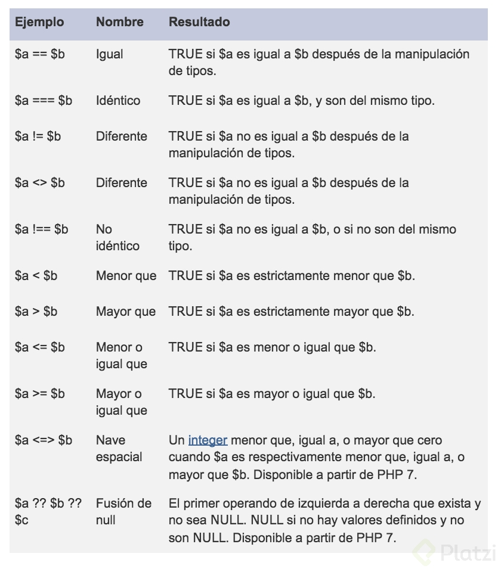
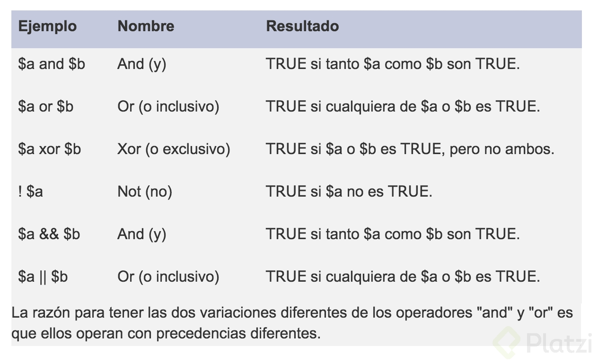

# Fundamentos de PHP

## Estructura

1. Para indicar que vamos a usar scripts de PHP debemos usar la siguiente sintaxis

```php
    <?php
        //code...
    ?>
```

Todos los script de PHP deben escribirse dentro de estas etiquetas.

2. Siempre, cada instrucción que escribamos de PHP debe terminar con " ; " para indicar que terminamos la instrucción

3. Un comentario es la manera en cómo podemos escribir sobre nuestros archivos PHP sin que sean interpretados, normalmente se usa para documentar el código que estamos escribiendo.

Para comentar una línea podemos usar doble slash seguido de tu comentario

```php
    <?php
        //My Comment
    <?
```

Para comentar varias líneas podemos usar slash y asterisco y cerrar con asterisco y slash

```php
    <?php
        /*  
            My 1 line
            My 2 line
            My 3 Line
        */
    <?
```

## Variables

Una variable es un espacio de memoria en nuestro computador donde podemos guardar información asignándoles un alias (nombre de la variable). Luego, si así lo deseamos, en un futuro podemos sustituir este valor en memoria por otro ayudándonos con el nombre de la variable.

Las variables en php no necesitan ser declaras sencillamente deben empezar con el símbolo "$" seguido del nombre que le queremos asignar a la variable por ejemplo: 

```php
    <?php
        $var_name = 5;
    ?>
```

>Para asignarle valores a una variable se utiliza el símbolo " = "

>Para nombrar variables debemos tener en cuenta la regla de que estas deben empezar por una letra o un guion bajo

PHP detectara por contexto el tipo de variable que estamos usando (enteros, string, booleanos, ... , etc.), por lo que no es necesario tiparlas.

El tipo de dato también puede ser cambiado (o casteado) dinámicamente, por ejemplo:

```php
    <?php
        $var_name = 5;
        $var_name = 'Now it is a strign';
    ?>
```

**Algunos tipos de datos primitivos en PHP**
```php
    <?php
        //Booleans
        $a = true; 
        $b = false;
        //Integer
        $c = 123;
        $d = -555;
        //float or double
        $e = 12.99;
        $f = 1.5e4;
        $g = 1E-10;
        //String
        $h = "Hi word";
        $i = 'Hellow everyone';
        //Null
        $j = null ;
    ?>
```

## Operadores

Las variables, además, pueden cumplir con todo tipo de operaciones aritméticas, como suma, resta, multiplicación y división.

```php
    <?php

        $var1 = 15;
        $var2 = 1;
        
        //Sum
        $res = $var1 + $var2 // 16

        //Subtraction
        $res = $var1 - $var2 //14

        //Multiplication
        $res = $var1 * $var2 //15

        //Division
        $res = $var1 / $var2 //15

        //Division residue
        $res = $var1 % $var2 //0

        //Exponentiation
        $res = $var1 ** $var2 //15 ( 15'1 )

    ?>
```

>En el caso de composición de operación, se operara de izquierda a derecha, dándole prioridad a la multiplicación y la división por encima de las sumas y restas

También existen operadores para acumular y retirar cantidades a una variable.

```php
    <?php
        
        $var1 = 5;
        $var2 = 3;

        //Acumulate
        $var1 = $var1 + $var2 // 8
        $var1 += $var2 // 8

        $var1 = $var1 * $var2 // 15
        $var1 *= $var2 // 15

        //Remove
        $var1 = $var1 - $var2 // 2
        $var1 -= $var2 // 2

        $var1 = $var1 / $var2 // 1.66
        $var1 /= $var2 // 1.66

        //Others
        $var1 = $var1 % $var2 //2
        $var1 %= $var2 //2

        $var1 = $var1 . $var2 //'53'
        $var1 .= $var2 //'53'

    ?>
```

**Operadores comparativos**
<h1 align="center">
    
    <br/>
</h1> 

**Operadores lógicos**
<h1 align="center">
    
    <br/>
</h1> 

## Concatenar Strings

Para concatenar podemos usar las siguientes opciones, suponiendo que quisiéramos concatenar la frase "Hola Mundo" podemos:

1. 
```php
    <?php
        $var_name = 'Mundo';
        $var_hola = 'Hola ' . $var_name;
    ?>
```

2.

```php
    <?php
        $var_name = 'Mundo';
        $var_hola = " Hola $var_name ";
    ?>
```

## Constantes

Una constante es un tipo de dato que no cambia, al igual que la variable asigna un alias a un valor dentro de la memoria de nuestra computadora, pero este está diseñado para no cambiar con el tiempo sino que se mantiene.

>Por convención en PHP las constantes se escriben en mayúsculas

La sintaxis para definir una variable es la siguiente :

```php
    <?php
        define( 'NAME_CONST', 'VAL_CONST' );
        define( 'PI', 3.14 );
    ?>
```

>Las constante son globales, lo que quiere decir que la podemos usar en cualquier momento y lugar de nuestro código.

## Condicionales

Las condicionales con if se ven así:

```php
    if($var){
        //code...
    }
    else if($var2){
        //code...
    }
    else{
        //code...
    }
```

## Ciclos

Los ciclos o bucles son de total importancia cuando desarrollamos software pues nos permiten repetir un bloque de acciones y en consecuencia re-utilizar mejor nuestro código.

1. Ciclo do-while

> Este ciclo siempre se ejecuta por lo menos una vez.

```php
    do {
        //code...
    } 
    while($var_condition)
```

En este ciclo ejecutamos el bloque de código que se encuentra dentro del ciclo y luego evaluamos la condicional dentro del ```while``` si esta se cumple iteramos el código.
    
2. Ciclo while

```php
    while($var_condition) 
    {
        //code...
    } 
   
```

Este ciclo funciona de la misma manera que funciona el ciclo ```do-while``` pero con la diferencia de que aquí primero se evalúa la condición y si esta cumple se ejecuta el código.

3. Ciclo for
```php
    for($var = 0; $var < 1000; $var++) {
        //code...
    } 
    
```

El primer parámetro se refiere a la inicialización de una variable contadora, el segundo indica cuando debe para la variable y el tercer parámetro es el paso o incremento que debe aumentar la variable en cada ciclo.

>Cuando se usa "**$var++**" tiene el mismo efecto que si se escribiera "$var = $var + 1 en cada iteración. **OBSERVACIÓN**: aunque parezca, no es igual escribir "**++$var**" que "**$var++**"

**Controles para los ciclos**

1. **continue ;**

La sentencia "**continue**" nos permite obviar todo lo que sigue en el código dentro del bloque del ciclo y pasar a la siguiente iteración.

2. **break ;**

La sentencia "**break**" nos permite forzar el final de un ciclo.

4. Ciclo foreach

Los ciclos foreach están diseñados para recorrer de manera muy sencilla arreglos, su sintaxis es la siguiente :

```php
    foreach ($array as $value) {
        //sentences with $value as each an element when iterating
    }
```

Si el array es asociativo entonces usamos :

```php
    foreach ($array as $key => $value) {
        //sentences with $key and $value as each the elements when iterating
    }
```

## Arreglos
Existen formas diferentes para declarar un Array.

1. Array

```php
    <?php

    $a = ["random_a1","... ", "random_an"];

    //view element
    echo $a[0];

    ?>
```

2. Array asociativo 

```php
    <?php

         //Array
        $b = array (
            "b_1" => "random_b1",
            "b_2" => "random_b2"
        );
        $c = [
            "c_1" => "random_c1",
            "c_2" => "random_c2"
        ];

        //view element
        echo $b["b_1"];
        echo $c["c_2"];

    ?>
```

## Llamar archivos

Podemos llamar archivos con diferentes modalidades : 

### Con include

```php

<?php

    include('path');

?>

```

De esta manera PHP buscara el archivo y de no encontrarlo intentara seguir con la aplicación mostrándonos un “warning”.

### Con require

```php

<?php

    require('path');

?>

```

De esta manera PHP buscara el archivo y de no encontrarlo dará un error y terminara la aplicación.

### Con require_once

Con "**require**" es posible llamar al mismo archivo más de una vez, lo que nos daría un error puesto que esto no está permitido en PHP, a veces esto no es conveniente, para solucionar esto podemos usar de la siguiente forma : 

```php

<?php

    require_once('path');

?>

```

## Checkear errores

A veces la configuración de nuestro servidor local no nos permite observar los errores que van ocurriendo mientras programamos.

Para ayudarnos con esto, una opción podría ser agregar entre las primeras líneas de nuestro proyecto el siguiente código : 

```php

<?php

    ini_set('display_errors', '1');
    ini_set('display_startup_errors', 1);
    error_reporting(E_ALL);

?>

```

Esto nos mostrara posibles errores en la pantalla del navegador lo que nos permitirá trabajar de una manera más cómoda.

## Manejo de rutas de archivos (Consideración)

PHP tiene el mismo sistema de manejo de rutas que tenemos la mayoría sino en todos los sistemas de rutas convencionales, con las mismas directrices básicas, pero es importante tener en cuenta que PHP buscara la ruta dependiendo del archivo donde sea ejecutado el script.

Es decir, si tenemos dos archivos "A" y "B" donde "B" es un script que llama a otro script escrito en "A", las rutas escrita en "A" serán relativas al lugar donde está alojado "B", es decir que las direcciones escritas en "A" son válidas para empezar a señalar cualquier ruta partiendo de la dirección de "B", en consecuencia si el script de "A" es también llamado en un archivo "C" localizado en una ruta muy diferente a la de "B" las rutas que señalaran pueden funcionar en "B" y crear conflictos en "C" sino se toman las debidas precauciones.

## Levantar un servidor desde la terminar

Con el comando

    $ php -S localhost:8080

Se puede levantar un servidor de desarrollo que usara tu carpeta actual como raíz, así ya no es necesario colocar las subcarpetas en el **URL**, aquí también podemos elegir el puerto que queramos sustituyendo el “8080” por el que elijamos.


