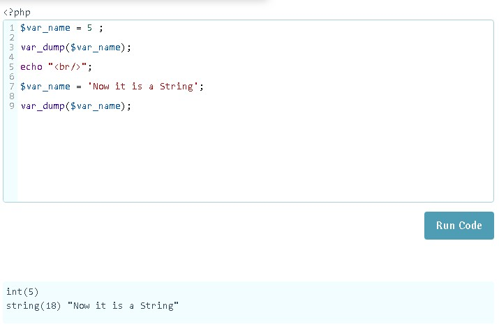

# Funciones en PHP

Son estructuras que nos permiten encapsular código para poderlo reutilizar.

Para escribir una función debemos usar la sintaxis :

```php

    function name_Funtion(){
        //code...
    }

```

>Para nombrar funciones debemos tener en cuenta la regla de que estas deben empezar por una letra o un guion bajo.

A las funciones podemos pasarle variables por parámetro, esto se vería así :

```php

    function name_Funtion($par1,$par2,$par3){
        //code where we can use the parameters as variables...
    }

```

Anteriormente solo definimos la función pero para que se ejecute debemos llamarla en el código : 

```php

<?php

    name_Function($par);

?>

```

Las funciones al ser llamadas dentro del código tiene la posibilidad de retornar algún valor y así, por ejemplo, guardar ese valor dentro de una variable : 

```php

    
    function sum_var($var1,$var2){
        return $var1 + $var2 ;
    }
    
    $res = sum_var(2,3); // res == 5

```

Las funciones tambien pueden tener parametros que traen **valores por defectos**, este puede ser util para casos en los que querríamos optar pasar valores a nuestra función en algunos casos y en algunos otros no:

```php

    function name_function($par = []){
        //code
    }

```

## Scope de funciones 

Las funciones en PHP no reconocen variables que no sean declaradas dentro de ellas o que sean pasadas por parámetros.

## Funciones integradas en PHP

PHP incluye por defecto algunas funciones que podemos utilizar para agilizar nuestro desarrollo, aquí se enlistan algunas de las más utilizadas y que es importante tener en 

### **Funciones para convertir una cade en Hash

Esto puede servir, por ejemplo, para guardar una contraseña en una base de datos

```php
    $password = 123;
    $password = $password = hash('sha512', $password);
```


### **Funciones que nos permiten testear variables** :

* Función **var_dump**
```php
    <?php
        $var_name = 5;
        var_dump($var_name);
    ?>
```

Esta función nos mostrara en pantalla información sobre la variable.

* Función **print_r**
```php
    <?php
        $var_name = 5;
        print_r($var_name);
    ?>
```

Esta función nos mostrara en pantalla información sobre la variable pero  menos detallas que la función var_dump.

<h1 align="center">
    
    <br/>
</h1> 

* Función **isset**

Esta función nos permite saber si una variable ha sido asignada

```php

    $random_var ;

    if(isset($random_var)){
        //code...
    }

```
Determina si una variable ha sido definida y no es nula. Devuelve FALSE en caso de le pasemos una variable sin definir, una variable definida pero sin valor o con el valor puesto a null, y en el resto de casos devuelve TRUE.

* Función **empty**
```php
    
    $random_var ;
    
    if(empty($random_var)){
        //code...
    }

```
Determina si la variable tiene un valor vacío, por llamarlo de alguna forma. En este caso devuelve TRUE en muchos supuestos: una cadena vacía (es decir “”, si es una cadena con un espacio en blanco tal que ” ” devolverá FALSE), un número 0 (sea tanto un entero, un float o una cadena con el número cero tal que “0”), una variable con el valor FALSE, una variable con el valor NULL, una variable definida pero sin valor y un array vacío. 

>Al contrario que "isset", no puede evaluar variables que no hayan sido definidas.


### **Funciones para trabajar con Arrays** :

* Función **count**
```php
    <?php
        $array_name = [1,5,6];
        count($array_name);//3
    ?>
```

Esta función retorna el tamañao de un array

### **Funciones para trabajar con matemática** :

* Function **floor**

```php
    <?php
        $var1 = 5,3;
        floor($var1);//5
    ?>
```

Esta función redondea hacia abajo una cantidad flotante

* Función **ceil**

```php
    <?php
        $var1 = 5,3;
        ceil($var1);//6
    ?>
```

Esta función redondea hacia arriba una cantidad flotante


### **Funciones para trabajar direcciones**

* Función **header**

```php
    header('location: ./path');
```

Con esta función podemos redirigir al usuario a alguna dirección deseada.

### **Funciones para trabajar con strings**

* Función **strtolower**

```php

    $string_var = 'LoCoMoToRo';
    strtolower($string_var); // 'locomotoro'

```


