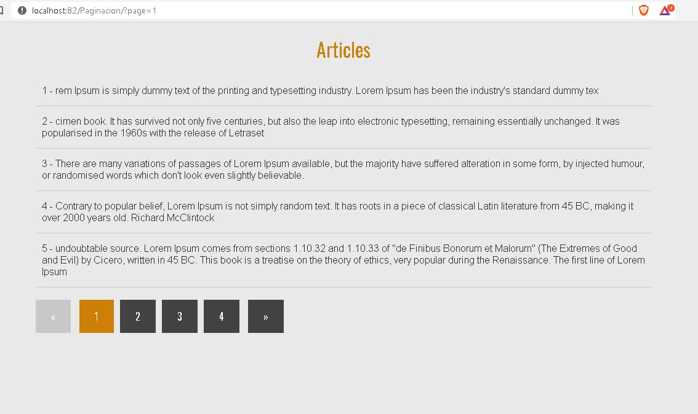
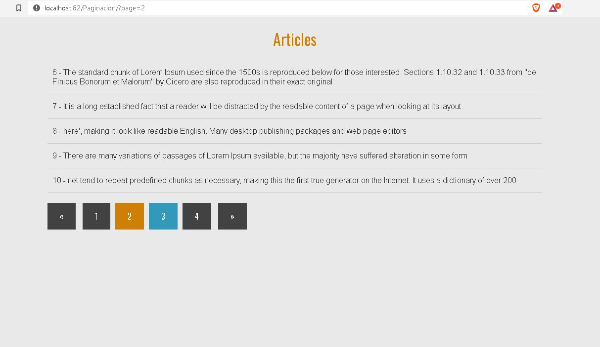

# Paginación con PHP

En este paginador para mostrar artículos de cualquier tipo, mostrando solo cierta cantidad por cada pagina.

## Screenshot :

<h1 align="center">
    
     
</h1> 

<h1 align="center">
    
</h1> 

## Esta práctica fue trabajada con : 

* **PHP**
* **MySQL**

